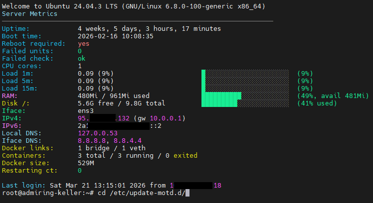

# 🖥️ Start SSH MOTD — красивый информационный MOTD для сервера

`server-stat-modt.sh` — это установочный Bash-скрипт, который настраивает аккуратный и полезный `MOTD` при входе по SSH. После установки вместо стандартного набора системных сообщений сервер показывает компактную сводку по состоянию системы: uptime, время загрузки, необходимость перезагрузки, failed units, загрузку CPU, RAM, диск, сетевые параметры и краткую информацию по Docker.



Такой вариант удобен, когда хочется сразу после входа видеть здоровье сервера без запуска дополнительных команд. Особенно полезно для VPS, Docker-нод, небольших мониторинговых узлов и серверов, куда заходишь регулярно вручную.

---

## ⚙️ Что делает скрипт

После запуска `files/server-stat-modt.sh` скрипт:

- создаёт `/etc/update-motd.d/99-server-stats`, если файла ещё нет
- делает его исполняемым
- отключает лишние стандартные блоки Ubuntu/Debian MOTD, чтобы убрать шум
- удаляет `50-landscape-sysinfo`, если он есть
- отключает и маскирует `motd-news.service`
- сбрасывает статус `failed` у systemd-юнитов
- отключает таймеры `apt-daily.timer` и `apt-daily-upgrade.timer`
- записывает внутрь кастомный shell-скрипт генерации MOTD
- сразу прогоняет `run-parts /etc/update-motd.d/`, чтобы вывести результат

Итог: при новом SSH-подключении сервер показывает уже не стандартный MOTD, а ваш собственный информативный блок.

---

## 📊 Что показывает новый MOTD

После установки при входе по SSH отображаются:

- `Uptime`
- `Boot time`
- статус `Reboot required`
- число `Failed units`
- подсказка, какой командой смотреть ошибки systemd
- количество CPU cores
- load average за `1m / 5m / 15m`
- использование RAM с цветной шкалой
- использование корневого диска `/`
- основной сетевой интерфейс
- внешний IPv4 и IPv6
- локальные DNS-серверы
- DNS, назначенные интерфейсу
- состояние Docker, если он установлен и доступен

Скрипт использует цветовые индикаторы: зелёный для нормального состояния, жёлтый/оранжевый для повышенной нагрузки и красный для проблемных значений.

---

## 🚀 Установка в одну команду

```bash
bash <(curl -Ls https://raw.githubusercontent.com/r00t-man/MZT/main/files/server-stat-modt.sh)
```

После выполнения:

1. закройте текущую SSH-сессию
2. подключитесь заново
3. новый MOTD появится автоматически

---

## 🛠️ Локальный запуск из репозитория

Если скрипт уже лежит локально:

```bash
sudo bash files/server-stat-modt.sh
```

---

## 🧩 Как работает логика внутри MOTD

Коротко по механике:

- данные по uptime берутся из `uptime`
- время последней загрузки — из `uptime -s` или `who -b`
- перезагрузка проверяется через `/var/run/reboot-required`
- failed units считаются через `systemctl --failed`
- загрузка CPU считается по `/proc/loadavg` относительно числа ядер
- память берётся из `free -m` и `free -h`
- диск `/` — через `df -h /`
- интерфейс и шлюз — через `ip route`
- IPv4/IPv6 — через `ip addr`
- DNS — из `/etc/resolv.conf` и `resolvectl`
- блок Docker отображается только если `docker` установлен и отвечает на `docker info`

То есть MOTD не просто печатает статичный баннер, а в реальном времени собирает текущие показатели системы при каждом входе в SSH.

---

## 🐳 Что показывает блок Docker

Если Docker установлен и доступен, MOTD дополнительно выводит:

- число всех контейнеров
- сколько из них запущено
- сколько остановлено (`exited`)
- сколько находится в состоянии `restarting`
- примерный суммарный размер Docker-данных
- число bridge-интерфейсов Docker
- число `veth`-интерфейсов

Если Docker не установлен, вместо этого будет аккуратный нейтральный вывод `n/a`, без ошибок и лишнего шума.

---

## ⚠️ Что важно учитывать

- Скрипт рассчитан на Linux-сервер с `systemd`.
- Для установки нужны `sudo` или `root`.
- Он отключает часть стандартных MOTD-блоков Ubuntu/Debian.
- Если вам нужны штатные уведомления Canonical/Ubuntu, их потом придётся включить обратно вручную.
- Если на сервере нет `resolvectl`, часть DNS-информации может показать `not found` — это нормально.
- Скрипт не ставит отдельные пакеты, а использует стандартные системные утилиты.

---

## ✅ Короткий итог

`Start SSH MOTD` — это простой способ сделать вход по SSH более полезным. Вместо стандартного приветствия вы сразу видите реальное состояние сервера: аптайм, нагрузку, память, диск, сеть, systemd-ошибки и Docker. Для повседневного администрирования это реально экономит время.
